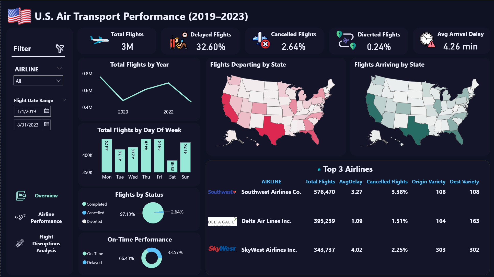

## ✈️ U.S. Air Transport Performance (2019–2023)

This project analyzes U.S. flight performance data between 2019 and 2023 through an interactive Power BI dashboard. 
The dashboard provides insights into airline operations, delays, cancellations, and on-time performance across multiple dimensions.

## 🎯 Objectives -Analyze U.S. domestic flight performance from 2019–2023 
-Track key metrics such as delays, cancellations, diversions, and average arrival delay 
-Compare airline performance by volume, punctuality, and cancellation rates 
-Identify main causes of disruptions (late aircraft, weather, carrier issues, etc.) 
-Provide actionable insights for improving operational efficiency

## 🛠️ Technologies Used 
-Microsoft Power BI 
-DAX (Data Analysis Expressions) 
-Power Query 
-Data Visualization and Dashboard Design

## 📂 File
US_Air_Transport_Performance_Dashboard.pbix

## 📸 Screenshots 
### Overview  

### Airline Performance 

### Flight Disruptions Analysis

## 📊 Dataset
Dataset source: 
[Flight Delay and Cancellation Dataset (2019-2023) - Kaggle](https://www.kaggle.com/datasets/patrickzel/flight-delay-and-cancellation-dataset-2019-2023)

---

✍️ Created by Mary Alimadadi
